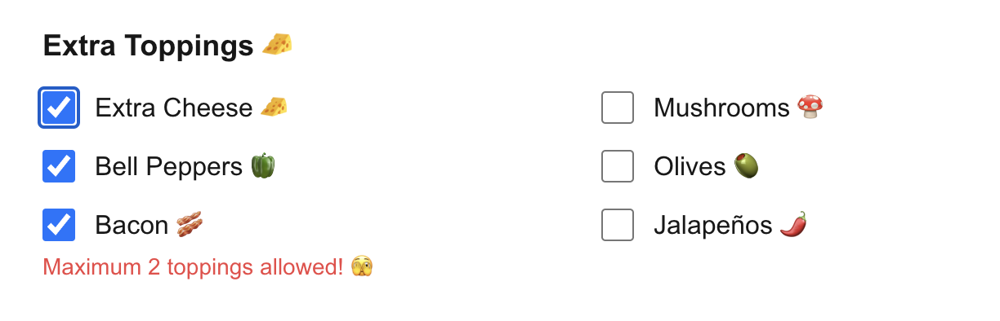

# 🍕 Pizza Order Form Validation

A pizza order form validation with Next.js 15, TypeScript, and Tailwind CSS.

## Demo





## Tech Stack

- [Next.js 15](https://nextjs.org/) - React framework
- [TypeScript](https://www.typescriptlang.org/) - Type safety
- [Tailwind CSS](https://tailwindcss.com/) - Styling
- [React Hook Form](https://react-hook-form.com/) - Form handling
- [Zod](https://zod.dev/) - Form validation
- [HookForm Resolvers](https://github.com/react-hook-form/resolvers) - Form validation integration

## Features

- Type-safe form handling with TypeScript
- Modern and responsive UI with Tailwind CSS
- Form validation using Zod
- Modular component architecture
- Real-time price calculation

## Getting Started

First, install the dependencies:

```bash
npm install
# or
yarn install
# or
pnpm install
# or
bun install
```

Then, run the development server:

```bash
npm run dev
# or
yarn dev
# or
pnpm dev
# or
bun dev
```

Open [http://localhost:3000](http://localhost:3000) with your browser to see the result.

## Project Structure

```
├── app/
│   ├── components/         # React components
│   │   ├── CustomerInfo.tsx
│   │   ├── PizzaForm.tsx
│   │   ├── PizzaTypeSelection.tsx
│   │   ├── ToppingsSelection.tsx
│   │   └── TotalPrice.tsx
│   ├── layout.tsx         # Root layout component
│   └── page.tsx           # Main page
├── lib/
│   ├── constants.ts       # Application constants
│   ├── schema.ts         # Zod validation schemas
│   └── types.ts          # TypeScript types
```

## Form Features

- Pizza type selection
- Extra toppings (up to 2)
- Customer information
- Real-time price calculation
- Form validation with error messages
